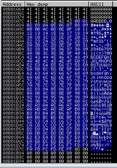
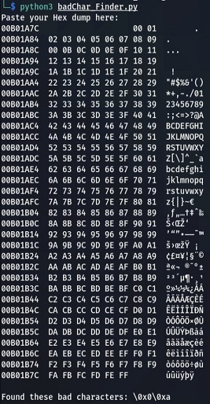

# BadChar Finder

- [BadChar Finder](#badchar-finder)
  - [:tada: Installation](#tada-installation)
  - [:computer: Usage](#computer-usage)
  - [:bulb: Example](#bulb-example)

**This python script search all bad Chars in a Hex dump.**

## :tada: Installation
```bash
git clone https://github.com/Marv963/badChar-Finder
```

## :computer: Usage
```bash
python3 badChar_Finder.py
```

## :bulb: Example

 <br>


```bash
python3 badChar_Finder.py
```

